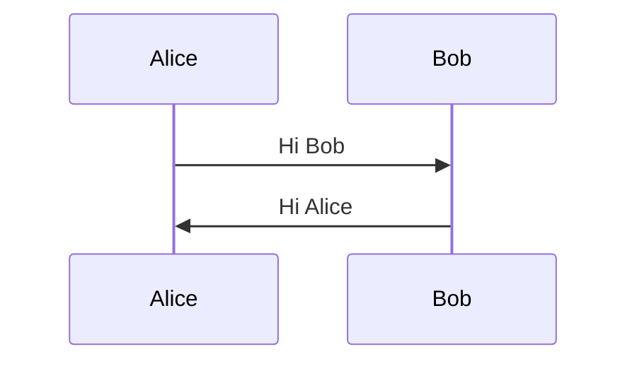
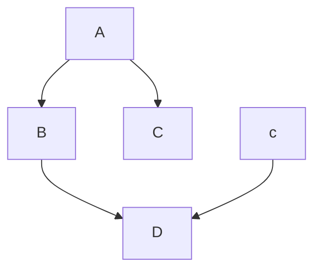

# task-1
task for an interview

```mermaid
sequenceDiagram
   participant Alice
   participant Bob
   Alice->>Bob: Hi Bob
   Bob->>Alice: Hi Alice
```

```mermaid
graph TD;
   A-->B;
   A-->C;
   B-->D;
   c-->D;
```

