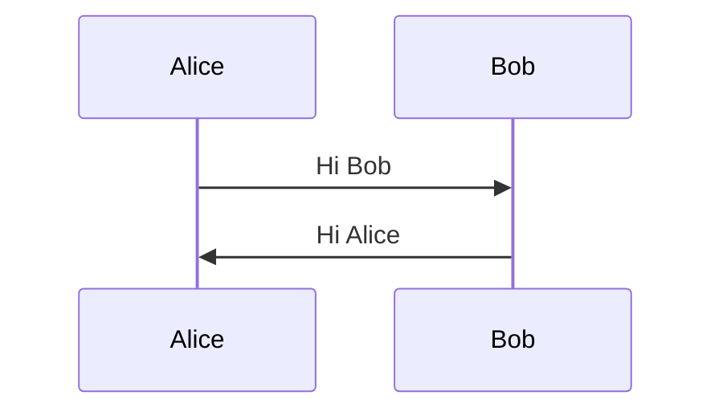

function test() {

  console.log("notice the blank line before this function?");

```mermaid

  sequenceDiagram

    participant Alice

    participant Bob

    Alice->>Bob: Hi Bob

    Bob->>Alice: Hi Alice

```

```mermaid

  graph TD;

    A-->B;

    A-->C;

    B-->D;

    C-->D;

```

}
